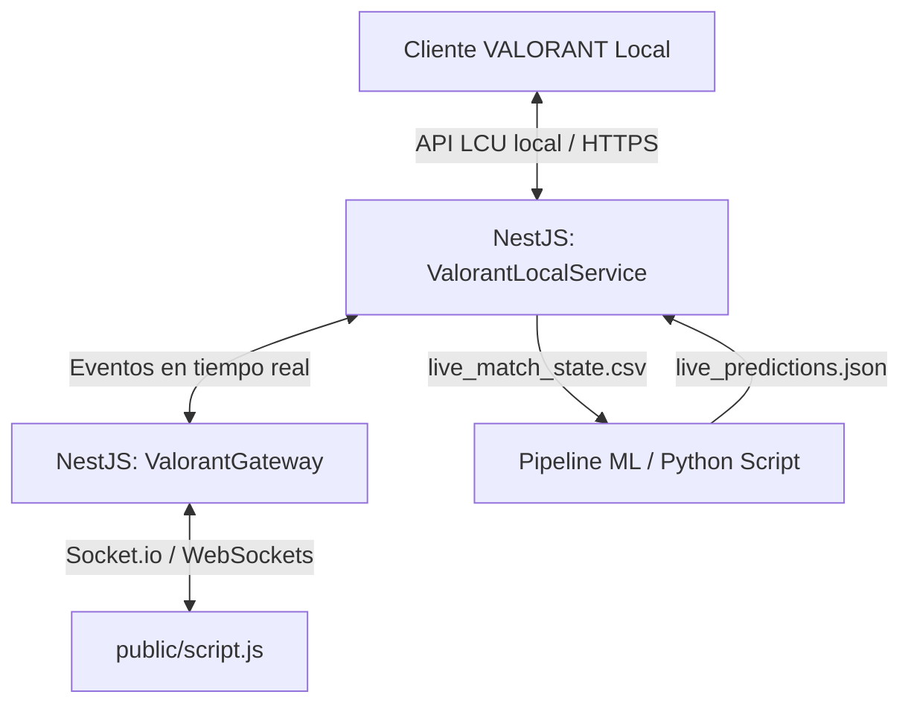

# Guía de Arquitectura, Gateway y Frontend de LoadoutAI

Esta guía explica en detalle cómo funciona toda la infraestructura de red, comunicación y lógica de **LoadoutAI**. Está estructurada para explicar de forma sencilla todos los conceptos de NestJS (backend), WebSockets (comunicación en tiempo real), la lectura del cliente local de Riot, y el JavaScript del navegador (`public/script.js`).

---

## 1. Perspectiva General del Sistema

LoadoutAI funciona como una aplicación de radar local híbrida. Para lograrlo, conecta tres capas principales:

1. **El Cliente de VALORANT (Local)**: Cuando juegas a VALORANT, el juego levanta un servidor web local secreto en tu ordenador para gestionar el chat, la lista de amigos y el estado de tu partida.
2. **El Servidor Backend (NestJS)**: Escanea continuamente tu ordenador buscando el archivo de credenciales de VALORANT (`lockfile`). Si el juego está abierto, lee su estado (Lobby, Selección de Agentes o Partida) y actúa como puente:
   - Extrae la información en tiempo real del juego.
   - Pasa los datos a un script de **Inteligencia Actor (Python)** para generar recomendaciones tácticas y de economía.
   - Envía actualizaciones constantes a la página web mediante **WebSockets**.
3. **El Panel Frontend (HTML/CSS/JS)**: Se conecta al servidor NestJS para renderizar la interfaz. Permite simular selecciones manualmente (modo Sandbox) o reflejar en tiempo real la selección de personajes y economía de tu partida en curso.



---

## 2. El Backend: La Carpeta `src/gateway/`

Esta carpeta contiene dos archivos esenciales en el servidor backend:
- `valorant.gateway.ts`: El servidor de WebSockets.
- `valorant-local.service.ts`: El escáner que lee el juego y ejecuta la IA.

### A. Explicación de `valorant.gateway.ts` (Servidor WebSockets)

Este archivo crea un canal de comunicación de alta velocidad y bidireccional (WebSockets) entre el backend y tu navegador web.

#### Decoradores y Configuración de Red
- **`@WebSocketGateway({ cors: { origin: "*" } })`**: Es un decorador que convierte la clase `ValorantGateway` en un servidor de WebSockets. La opción `cors: { origin: "*" }` desactiva las restricciones CORS del navegador. Esto es necesario para que una web abierta localmente pueda conectarse sin que el navegador la bloquee por motivos de seguridad.
- **`@WebSocketServer()`**: Inyecta la instancia del servidor nativo de Socket.io en la variable `server`. Esto nos permite enviar mensajes masivos a todos los navegadores conectados.

#### Variables de Estado
- **`currentStatus`**: Guarda en memoria el estado actual del juego (ej. `'CLOSED'`, `'MENU'`, `'PREGAME'`, `'INGAME'`).
- **`extraData`**: Diccionario que almacena datos dinámicos adicionales (por ejemplo, el nombre del mapa actual, los nombres de los jugadores o sus rangos).
- **`buyPhaseStatus`**: Guarda si la fase de compra está activa, los segundos restantes y la ronda en curso.
- **`pregameSelect$`, `pregameLock$`, `ingameCredits$`**: Son flujos reactivos de RxJS (`Subject`). Actúan como canales de mensajes internos dentro del backend: cuando el navegador envía una acción (como pre-seleccionar un agente), estos flujos la capturan y notifican al radar.

#### Métodos Principales
1. **`handleConnection(client: Socket)`**: Se ejecuta automáticamente cada vez que alguien abre la web. Envía de inmediato el estado actual del juego (`valorant_status`) y la información de la fase de compra (`buy_phase`) al nuevo cliente para que la pantalla no se quede en blanco.
2. **`updateStatus(status, data)`**: Cambia el estado en memoria y emite el evento `"valorant_status"` con todos los metadatos (mapa, jugadores, etc.) a todos los usuarios conectados.
3. **`emitBuyPhaseStatus(available, time, round)`**: Notifica a la web el estado de la fase de compra.
4. **`@SubscribeMessage("load_all")` / `handleLoadAll()`**: Escucha cuando la web pide cargar la base de datos oficial. Realiza llamadas asíncronas consecutivas para descargar información actualizada de agentes, mapas y armas desde la API pública de Valorant, emitiendo porcentajes de carga (`loading_progress` del 10% al 100%) al navegador.
5. **`@SubscribeMessage("pregame_select")` / `handlePregameSelect()`**: Escucha cuando el usuario hace clic sobre un agente en el modo online y envía los datos al flujo reactivo `pregameSelect$`.
6. **`@SubscribeMessage("pregame_lock")` / `handlePregameLock()`**: Escucha cuando el usuario confirma su personaje y envía los datos a `pregameLock$`.
7. **`@SubscribeMessage("update_ingame_credits")` / `handleUpdateIngameCredits()`**: Escucha cuando el jugador cambia su cantidad de créditos en la interfaz web y envía los datos a `ingameCredits$`.
8. **`emitMlBuyRecommendations(data)`**: Envía las recomendaciones de compra calculadas por la IA de Python a la web con el evento `"ml_buy_recommendations"`.

---

### B. Explicación de `valorant-local.service.ts` (Servicio Radar Local)

Este archivo es el cerebro del backend. Escanea tu ordenador, interactúa con el cliente oficial de Riot y coordina las ejecuciones del script de Python.

#### Diccionarios de Traducción
- **`MAPS_MAP`**: Mapea los nombres de mapas internos del motor Unreal Engine de Valorant (ej. `/Game/Maps/Ascent/Ascent`) a nombres limpios de mapas de cara al usuario (ej. `Sunset`).
- **`QUEUES_MAP`**: Traduce los nombres internos de las colas de emparejamiento (ej. `competitive`) a nombres legibles (ej. `Competitive`).

#### Inicialización del Radar (`onModuleInit`)
Cuando arranca el servidor, se ejecuta este método que realiza tres tareas críticas:
1. **Bucle de comprobación**: Crea un intervalo que se ejecuta cada **2 segundos** (`setInterval`) para llamar a la función `checkStatus()`.
2. **Suscripción a WebSockets**: Se suscribe a los eventos del Gateway (`pregameSelect$`, `pregameLock$`, e `ingameCredits$`). Cuando la web envía alguna de estas peticiones, ejecuta los métodos HTTP correspondientes para enviar la selección al juego real de Riot.

#### Lectura del Archivo de Riot (`getCredentials`)
Para comunicarse con el cliente local de VALORANT, el backend lee un archivo llamado `lockfile` ubicado en:
`%LocalAppData%\Riot Games\Riot Client\Config\lockfile`
Este archivo contiene una línea con el formato `nombre:PID:puerto:contraseña:protocolo` (por ejemplo, `RiotClient:10243:52881:a9F8g77A:https`).
1. **`fs.readFileSync`** lee este archivo.
2. **`content.split(':')`** separa los componentes.
3. **`Buffer.from`** cifra en Base64 las credenciales en formato `riot:contraseña` para cumplir con el protocolo de autenticación básica de la LCU.
4. Devuelve la URL local (`https://127.0.0.1:puerto`) y el encabezado `Authorization: Basic [token]`.

#### Configuración de Autenticación Remota (`getRemoteConfig`)
Para realizar acciones directamente en los servidores oficiales en la nube de Riot (como fijar personajes o ver estadísticas detalladas), se requiere una clave de autorización temporal (`accessToken` y `entitlementsToken`).
1. Pide un token temporal al cliente local haciendo un GET a `/entitlements/v1/token`.
2. Consulta la versión actual del cliente en `https://valorant-api.com/v1/version` para que Riot no bloquee la petición por cliente obsoleto.
3. Resuelve el Shard correspondiente según tu región configurada en el archivo [.env](file:///C:/Users/chumi/OneDrive/Escritorio/LoadoutAI/valorant-ai/.env) (ej. si la región es `eu`, la URL del servidor oficial de emparejamiento de Riot será `https://glz-eu-1.eu.a.pvp.net`).
4. Genera los encabezados necesarios, incluyendo tokens JWT y datos de plataforma de cliente simulada (enviados en Base64).

#### Escaneo del Estado del Juego (`checkStatus`)
Cada 2 segundos, esta función consulta el estado de la partida:
1. Hace una petición HTTP local a `/chat/v1/session` para descubrir el `puuid` (ID único de jugador) de tu cuenta de Riot.
2. Consulta `/chat/v4/presences` para ver el estado de todos los jugadores de tu chat.
3. Busca tu propia presencia y decodifica su campo `private` (que viene en una cadena codificada en Base64).
4. Al parsear esta presencia, obtiene el estado de bucle del juego (`sessionLoopState`):
   - **`PREGAME` (Fase de selección)**:
     - Realiza peticiones HTTPS remotas al servidor GLZ de Riot para obtener el `MatchID` de la selección de agentes activa y los datos de tu equipo (`/pregame/v1/matches/MatchID`).
     - Mapea el mapa oficial, extrae la lista de agentes pre-seleccionados y bloqueados por tus aliados, y calcula la predicción de agente de la IA (`runMLPrediction`).
     - Envía todo al Gateway.
   - **`INGAME` (Partida en curso)**:
     - Consulta los datos de partida real mediante `/core-game/v1/matches/MatchID`.
     - Identifica a tus aliados, sus personajes, niveles y rangos.
     - Lee las variables `partyOwnerMatchScoreAllyTeam` y `partyOwnerMatchScoreEnemyTeam` de la presencia para detectar las rondas ganadas y perdidas en tiempo real.
     - Si la ronda cambia, inicia de manera autónoma un temporizador local para la **fase de compra** (45 segundos en rondas de pistolas/cambio de bando, y 30 segundos en rondas estándar) y lanza la predicción económica de la IA.
   - **`MENU` o `CLOSED`**:
     - Limpia los datos de partida y notifica que el juego está en el lobby o apagado.

#### Conexión con el Modelo de Machine Learning (`runMLPrediction`)
Para estimar las mejores composiciones y compras, el backend escribe los datos actuales en un archivo CSV y ejecuta el script de Inteligencia Artificial escrito en Python:
1. Genera una estructura de texto con formato CSV que contiene el mapa, la ronda, los marcadores, tus créditos actuales y las listas de agentes aliados y enemigos.
2. Escribe el archivo en `contenido/live_match_state.csv`.
3. Invoca el ejecutable de Python de tu entorno virtual (`.venv/Scripts/python.exe`) pasando como argumento el script `contenido/predict_live.py`.
4. El script de Python procesa el CSV mediante modelos entrenados (Scikit-Learn) y guarda sus resultados en `contenido/live_predictions.json`.
5. El backend lee el archivo JSON resultante, lo parsea y lo envía de vuelta a tu frontend.

---

## 3. El Frontend: El script `public/script.js`

Este archivo se ejecuta en el navegador web del usuario y gestiona la interactividad de la interfaz de usuario, la lógica de simulación offline y la escucha del servidor NestJS.

### A. Constantes de Configuración Estática
- **`MAP_RECOMMENDATIONS`**: Base de datos local que contiene los 4 mejores agentes sugeridos por mapa con sus tasas de victoria estimadas de alto rango y sus UUIDs oficiales de Riot.
- **`MAP_SPLASHES`**: Direcciones URL absolutas de las imágenes de fondo de cada mapa para decorar la pantalla HUD de partida.
- **`MAP_TACTICAL_STATS`**: Métricas tácticas de cada mapa (ej. porcentaje de victorias del bando atacante y defensor, duración media de rondas, zonas calientes para plantar la Spike y composiciones recomendadas).

---

### B. Variables de Estado Global de la Web
- **`isLiveMode`**: Booleano (`true` / `false`) que indica si la interfaz está conectada a una partida real de VALORANT (`true`) o si está en modo simulador local (`false`).
- **`activeTab`**: Guarda el rol de agente seleccionado en el filtro de la parrilla (valores: `'all'`, `'duelist'`, `'initiator'`, `'controller'`, `'sentinel'`).
- **`agentsList`**: Array dinámico que contendrá todos los agentes jugables oficiales descargados de la API de Riot.
- **`selectedMap`**: El mapa seleccionado actual en el desplegable de la cabecera.
- **`currentDraftSlot`**: Indica sobre qué ranura del equipo (del 1 al 5) se aplicará la siguiente selección de personaje.
- **`myTeam`**: Array de 5 objetos que representa el estado de tus aliados:
  ```javascript
  { puuid: 'p1', name: 'Ally 1 (You)', agentId: null, state: '', level: 125, rank: 21, playerCardId: '' }
  ```
- **`activeSelectedAgent`**: El agente que tienes pre-seleccionado en la cuadrícula pero que aún no has bloqueado.
- **`agentsCache` y `ranksCache`**: Tablas de búsqueda optimizadas para recuperar datos e imágenes de agentes y rangos de forma instantánea usando sus identificadores numéricos o UUIDs.

---

### C. Inicialización de Datos Oficiales (`initData`)
Es una función asíncrona (`async`) que se ejecuta nada más abrir la web:
1. Realiza una petición GET al API pública de Riot: `https://valorant-api.com/v1/agents?isPlayableCharacter=true`.
2. Procesa la respuesta para guardar las imágenes de retrato (`displayIcon`, `fullPortrait`), descripciones e iconos de habilidades de cada agente en la caché local (`agentsCache`).
3. Consulta la URL pública de tiers competitivas (`https://valorant-api.com/v1/competitivetiers`) para descargar los nombres e imágenes de todos los rangos oficiales (Hierro, Bronce... Radiante) y almacenarlos en `ranksCache`.
4. Llama a los métodos de dibujo (`renderTeam()`, `renderAgentsGrid()`, `renderRecommended()`) para pintar los elementos por primera vez en la pantalla.

---

### D. Métodos de Control Visual de la Interfaz

#### 1. Navegación entre vistas (`switchView`)
Recibe el nombre de la vista a mostrar (ej. `'pregame'`). Elimina la clase CSS `.active` de todas las vistas con selector de clases y se la añade únicamente a la vista indicada para mostrarla en pantalla con transiciones suaves.

#### 2. Parrilla de Agentes (`renderAgentsGrid`)
Dibuja dinámicamente los retratos de los personajes disponibles en la interfaz:
1. Filtra los personajes de `agentsList` según el rol seleccionado en las pestañas (`activeTab`).
2. Los ordena alfabéticamente por su nombre.
3. Crea un elemento `div` para cada agente:
   - Si coincide con tu selección actual, le añade la clase `.selected` (borde brillante cian).
   - Si algún aliado ya lo ha bloqueado en `myTeam`, le añade la clase `.picked` (se muestra en escala de grises y opacidad reducida) y añade un letrero de "PICKED".
4. Asigna el evento de clic de cada elemento a la función `selectAgent(agent)`.

#### 3. Detalles de Selección (`selectAgent`)
Se ejecuta cuando haces clic en la imagen de un agente en la cuadrícula:
1. Comprueba si el personaje ya está cogido por un compañero para impedir su selección.
2. Guarda el agente en `activeSelectedAgent`.
3. Actualiza el panel de detalles inferior: muestra el retrato completo de alta resolución del agente, su nombre, su descripción biográfica oficial y genera iconos dinámicos para sus cuatro habilidades que muestran información al pasar el ratón.
4. Si la web está conectada en tiempo real al juego (`isLiveMode`), envía la pre-selección al backend por medio del evento de WebSocket `'pregame_select'`.

#### 4. Confirmación de Personaje (`lockSelection`)
Se ejecuta al hacer clic sobre el botón "Lock Agent":
1. Si está en modo online (`isLiveMode`), le dice al servidor NestJS que deseas bloquear el agente enviando el evento de WebSocket `'pregame_lock'`.
2. Si está en modo simulator local:
   - Guarda el agente en la ranura activa de tu equipo (`myTeam[currentDraftSlot]`) y cambia su estado a `"locked"`.
   - Busca de forma automática la siguiente ranura que esté vacía en el equipo y la selecciona.
   - Redibuja la lista del equipo, actualiza la cuadrícula de personajes (para bloquear el agente que acabas de coger) y recalcula la sinergia táctica.

#### 5. Lista de Jugadores de tu Equipo (`renderTeam`)
Genera la lista visual del equipo en la columna izquierda:
1. Itera por los 5 jugadores del array `myTeam`.
2. Dibuja el número de jugador, su nombre de cuenta, su nivel y el retrato del agente que tenga seleccionado o un icono genérico de usuario si la ranura está abierta.
3. Si el jugador tiene un fondo de tarjeta decorativo (`playerCardID`), realiza una petición a los servidores oficiales de Riot para recuperar la imagen panorámica de la tarjeta (`wideart.png`) y la inyecta como propiedad de fondo CSS (`backgroundImage`) con un degradado oscuro superpuesto para garantizar la legibilidad del texto.
4. En el modo simulator offline, añade un botón con una cruz roja (`clear-slot-btn`) para vaciar la ranura del personaje y reajustar los cálculos.

#### 6. Inteligencia del Mapa (`renderRecommended` e `ingame` stats)
1. Lee las recomendaciones del mapa seleccionado y las dibuja en orden descendente, mostrando el nombre del agente, su retrato circular, su rol y su porcentaje esperado de victorias. Al hacer clic en una tarjeta de recomendación, la web selecciona ese personaje automáticamente.
2. Dibuja la ficha técnica táctica del mapa:
   - Crea una barra de progreso que representa el ratio de victorias de atacantes (color rojo) frente a defensores (color cian).
   - Inyecta la zona más típica para plantar la Spike, composiciones populares de torneos profesionales y consejos de juego rápidos.

---

### E. El Algoritmo de Sinergia y Análisis Táctico (`updateSynergy`)

Esta función evalúa en tiempo real la combinación de agentes en tu equipo para calcular un porcentaje de sinergia y emitir recomendaciones:

1. **Variables de control**: Inicializa un valor base de sinergia en **50%**. Lleva un conteo del número de personajes por rol (Duelistas, Iniciadores, Controladores y Centinelas) y de cuántos agentes tienen habilidades curativas (Sage y Skye).
2. **Evaluación de Roles Críticos**:
   - **Controlador (Humos)**: Los humos son fundamentales para bloquear la visión en cuellos de botella. Si el equipo tiene al menos un Controlador, suma **+20%** a la sinergia. Si no tiene ninguno, resta **-20%** (penalización crítica).
   - **Curación**: Si hay curanderos, suma **+15%**. Si no hay ninguno, resta **-15%**.
   - **Duelista e Iniciador**: Si el equipo cuenta con potencial de entrada (Duelista) y habilidades de escaneo de información (Iniciador), suma **+10%**. Si no hay duelistas, resta **-10%**.
   - **Centinela (Defensa)**: Si hay un personaje capaz de blindar zonas defensivas, suma **+10%**.
   - **Alineación con el Mapa**: Por cada personaje de tu equipo que figure en la lista oficial de recomendados para el mapa activo, suma **+5%** (hasta un límite de +15%).
3. **Límites de Puntuación**: Restringe la sinergia calculada para que se mantenga estrictamente en un rango de entre **15%** y **100%**.
4. **Retroalimentación Visual**:
   - **Puntuación >= 85%**: Letrero verde de "Sinergia de Equipo de élite".
   - **Puntuación >= 65%**: Letrero amarillo de "Composición equilibrada".
   - **Puntuación < 65%**: Letrero rojo de "Composición desequilibrada".
5. **Animación del Medidor SVG**:
   El medidor semicircular de la interfaz se controla mediante un gráfico vectorial SVG con un gradiente multicolor (rojo, amarillo y verde). 
   - El contorno total del arco tiene una longitud de trazo de **188.4 unidades** (calculado con la fórmula matemática $\pi \times r$ donde $r=55$).
   - Para rellenar el arco según el porcentaje de sinergia, la función calcula el desfase del contorno (`strokeDashoffset`):
     $$\text{Offset} = 188.4 - \left(\frac{\text{Sinergia}}{100} \times 188.4\right)$$
   - Aplica este valor mediante estilos CSS para animar de forma fluida el arco del medidor en el navegador.
6. **Buzón de Vulnerabilidades (`renderAlerts`)**:
   Si faltan controladores, iniciadores, duelistas o soporte en los recuentos, dibuja dinámicamente tarjetas de alerta de prioridad alta o media de color rojo o amarillo sugiriendo qué personajes deberían seleccionarse para equilibrar la composición. Si la composición es perfecta, dibuja un letrero verde de optimización.

---

### F. Escucha de Eventos WebSockets (Integración en Tiempo Real)

El frontend se conecta al servidor local mediante `const socket = io('http://localhost:3000')` y escucha los siguientes eventos dinámicos enviados por NestJS:

1. **`connect` / `disconnect`**: Cambia el indicador visual de conexión de la cabecera (Radar Online en verde / Radar Offline en rojo) y cambia la vista principal de la web.
2. **`valorant_status`**: Recibe las actualizaciones de estado en tiempo real del juego de Riot:
   - **`CLOSED`**: Redirige a la pantalla de espera de juego cerrado.
   - **`MENU`**: Redirige a la pantalla de queue/standby del lobby.
   - **`PREGAME`**: Pasa al modo selección de personaje de forma automática. Actualiza los jugadores reales que están en tu lobby de juego, sus rangos e iconos, e inhabilita el selector de mapas manual para que la web muestre exactamente el mapa que ha asignado la partida de Riot.
   - **`INGAME`**: Cambia la web a la interfaz HUD de partida en tiempo real. Configura el fondo de pantalla con la imagen del mapa oficial e inicia los widgets de compra.
3. **`buy_phase`**: Recibe si estás en fase de compra y el tiempo disponible en la ronda:
- Muestra u oculta la tarjeta flotante de compra rápida.
   - Si la fase está activa, inicia una barra de cuenta atrás visual de color verde y actualiza el texto de consejo rápido de entrenador en tiempo real según el bando del jugador (ej. Atacantes / Defensores) y el mapa de juego.
4. **`ml_buy_recommendations`**: Recibe la recomendación estratégica y económica calculada por la Inteligencia Artificial:
   - **Detalles de la compra**: Inyecta en los paneles el arma recomendada (ej. Vandal), el blindaje recomendado (ej. Heavy Shield) y las habilidades, calculando el coste acumulado mediante la función `getWeaponCost`.
   - **Predicción Económica del Enemigo**: Inyecta en el panel inferior los créditos medios estimados del equipo rival, el equipamiento esperado que comprarán y la clasificación de riesgo de la ronda enemiga (ej. ronda de ahorro, compra media o compra completa peligrosa).

---

## 4. Inmersión Profunda en el Tiempo Real y Control Bidireccional

La capacidad de ver en tiempo real lo que ocurre en tu partida y enviar comandos (como pre-seleccionar o fijar un personaje) desde una simple página HTML es posible gracias a una combinación de **WebSockets** y **comunicación local con la API interna de Riot Games**.

### A. La Magia de WebSockets vs HTTP Tradicional
En el desarrollo web estándar, el cliente (la web) inicia todas las conversaciones mediante peticiones HTTP. El servidor no puede hablarle a la web a menos que esta le pregunte primero.

En LoadoutAI, el uso de **Socket.io** establece un canal de WebSockets:
* Al cargarse la web, `io('http://localhost:3000')` realiza una conexión permanente.
* El canal permanece abierto. Es como una llamada de voz activa: el servidor NestJS puede "hablarle" al navegador en cualquier milisegundo para avisarle de sucesos del juego, y el navegador puede enviarle comandos al backend inmediatamente sin tiempos de espera.

---

### B. El Flujo de Lectura: Del Juego a la Pantalla (Tiempo Real)

Cada vez que ocurre algo en tu partida, los datos viajan en esta secuencia exacta:

```
[ Cliente Real de VALORANT ]
         │ (Fija un agente o cambia la puntuación)
         ▼
[ Riot Client local (lockfile) ]
         │
         │ (1. El backend consulta la API local cada 2 segundos)
         ▼
[ NestJS (ValorantLocalService) ]
         │
         │ (2. Detecta el cambio e invoca gateway.updateStatus)
         ▼
[ Gateway WebSockets ]
         │
         │ (3. server.emit("valorant_status", data) - Lanza el evento por red)
         ▼
[ Navegador Web (script.js) ]
         │
         │ (4. socket.on("valorant_status") - Captura y parsea los datos)
         ▼
[ Modificación del DOM ] (5. Dibuja retratos, actualiza barras de sinergia)
```

1. **El Cliente Local actualiza su memoria**: Cuando un jugador pre-selecciona un agente, el cliente de Riot cambia sus datos de presencia local.
2. **El Escáner del Backend lee los datos**: Cada 2 segundos, `checkStatus()` en NestJS lee esta presencia codificada en Base64, la descifra, y obtiene la información.
3. **Se retransmite por WebSockets**: NestJS emite los datos del estado a través de la conexión WebSocket activa.
4. **La Web reacciona**: El navegador recibe el evento, ejecuta el código de renderizado y redibuja la interfaz visual utilizando Javascript para manipular el árbol DOM (Document Object Model) del navegador.

---

### C. El Flujo de Escritura: De la Web al Juego (Interactividad)

Cuando haces clic en la interfaz web para fijar a un personaje, el flujo de datos viaja hacia el interior del juego real:

```
[ Navegador Web ]
         │ (Haces clic en Jett y pulsas "Lock Agent")
         ▼
[ Frontend (script.js) ]
         │ (1. socket.emit("pregame_lock", { pregameMatchId, agentUuid }))
         ▼
[ Gateway WebSockets (NestJS) ]
         │ (2. Recibe el evento y lo inyecta en pregameLock$)
         ▼
[ Backend (ValorantLocalService) ]
         │ (3. La suscripción se activa al recibir datos en el flujo)
         │ (4. Realiza un POST HTTPS a la API local del juego de Riot)
         ▼
[ API LCU de VALORANT ] ---> [ El cliente real de VALORANT bloquea a Jett ]
```

1. **La web lanza el evento**: Al presionar el botón, la web emite la orden:
   ```javascript
   socket.emit('pregame_lock', { pregameMatchId, agentUuid });
   ```
2. **NestJS intercepta la orden**: En el Gateway backend, se asocia el evento mediante `@SubscribeMessage("pregame_lock")` y se inyecta en un objeto observable `pregameLock$`.
3. **El servicio de radar local realiza el comando**: El servicio lee la orden de ese canal y ejecuta una llamada HTTP `POST` a la API LCU de Riot:
   ```typescript
   await this.httpService.post(`${glzUrl}/pregame/v1/matches/${matchId}/lock/${agentUuid}`, {}, { headers });
   ```
4. **El juego real responde**: El cliente interno del juego procesa la llamada HTTP de NestJS igual que si hubieras pulsado con el ratón dentro del propio menú del juego. Jett se bloquea en tu lobby real de VALORANT.

### D. ¿Cómo es esto posible? (La API LCU)
El juego real de VALORANT está estructurado internamente como una arquitectura de microservicios locales. El ejecutable visual del juego es simplemente una interfaz que se comunica con una API REST HTTPS local levantada por el propio proceso del cliente de Riot. 

Al leer el archivo secreto `lockfile`, LoadoutAI extrae la contraseña e IP dinámicas del puerto local y se comunica con esta API secreta (LCU), permitiendo controlar el juego de forma programática.

---

## 5. El Salto de Sintaxis: Comparativa Directa JS (Express) vs NestJS (TypeScript)

Escribir JavaScript para el navegador (`public/script.js`) es muy directo: declaras variables, manipulas el DOM con `document.getElementById` y haces peticiones con `fetch`. Sin embargo, cuando miras por primera vez el código backend de NestJS en TypeScript, parece un lenguaje de otro mundo debido a los decoradores (`@`), las clases, los tipos y la inyección de dependencias.

A continuación, comparamos los conceptos de JS tradicional y NestJS lado a lado para hacer este salto de sintaxis muy fácil de entender.

---

### A. Estructura de Servidor y Rutas (Express vs NestJS)

En un backend clásico con **JavaScript + Express**, todo se escribe de forma imperativa en uno o pocos archivos. En **NestJS**, se usa una arquitectura orientada a objetos (clases) y decoradores (declarativa).

#### 1. Cómo se levanta el servidor
En **Express (JS)**:
```javascript
const express = require('express');
const app = express();
app.use(express.static('public'));
app.listen(3000, () => console.log('Servidor corriendo en el puerto 3000'));
```

En **NestJS (TypeScript)**:
NestJS separa la inicialización (el arranque) de la configuración de la aplicación.
* El archivo [main.ts](file:///C:/Users/chumi/OneDrive/Escritorio/LoadoutAI/valorant-ai/src/main.ts) inicia la aplicación:
  ```typescript
  async function bootstrap() {
    const app = await NestFactory.create<NestExpressApplication>(AppModule);
    app.useStaticAssets(join(__dirname, "..", "public")); // Expone la carpeta public
    await app.listen(3000);
  }
  bootstrap();
  ```
* El archivo [app.module.ts](file:///C:/Users/chumi/OneDrive/Escritorio/LoadoutAI/valorant-ai/src/app.module.ts) actúa como el "organizador" central, declarando todos los controladores y servicios que usará el servidor.

#### 2. Cómo se define una ruta HTTP
En **Express (JS)**:
```javascript
app.get('/agents', (req, res) => {
  res.json([{ name: 'Jett' }, { name: 'Phoenix' }]);
});
```

En **NestJS (TypeScript)**:
Se utilizan clases y decoradores. Mira el archivo [agents.controller.ts](file:///C:/Users/chumi/OneDrive/Escritorio/LoadoutAI/valorant-ai/src/valorant_api/agents/agents.controller.ts):
```typescript
@Controller("agents") // 1. Indica que todas las rutas de esta clase empiezan por /agents
export class AgentsController {
  constructor(private readonly agentsService: AgentsService) {}

  @Get() // 2. Indica que un método GET a /agents llamará a esta función
  loadAgents() {
    return this.agentsService.loadAgents(); // 3. Devuelve los datos directamente
  }
}
```

---

### B. ¿Qué son los Decoradores? (Las palabras con `@`)

Los decoradores son una característica especial de TypeScript. Son simplemente **funciones que añaden metadatos o superpoderes** a una clase, método o propiedad.

* **`@Injectable()`**: Le dice a NestJS: *"Esta clase es un servicio. Puedes crearla una sola vez en memoria y compartirla con cualquier otra clase que la necesite"*.
* **`@Controller('ruta')`**: Convierte una clase normal en un receptor de peticiones HTTP (rutas GET, POST, DELETE, etc.).
* **`@WebSocketGateway()`**: Convierte una clase normal en un servidor de WebSockets (Socket.io) para comunicación en tiempo real.
* **`@SubscribeMessage('evento')`**: Escucha un mensaje de WebSocket específico enviado desde la web.

> [!NOTE]
> En JavaScript tradicional no tienes decoradores; tenías que registrar cada ruta manualmente: `app.get('/ruta', funcion)`. En NestJS, con solo poner `@Get()` encima de un método, NestJS se encarga de crear la ruta por debajo.

---

### C. TypeScript y Tipado Estricto (Los dos puntos `:`)

En el navegador escribes `const agent = data;` sin importar qué contiene `data`. En TypeScript, añadimos tipos después de los dos puntos (`:`) para que el editor de código nos avise si cometemos un error antes de ejecutar el programa.

* **Tipado simple**:
  ```typescript
  let credits: number = 3000;
  let agentName: string = "Jett";
  let isAlive: boolean = true;
  ```
* **Tipado de funciones**:
  ```typescript
  // Indica que esta función DEBE devolver un número
  getWeaponCost(weaponName: string): number {
    if (weaponName === "Vandal") return 2900;
    return 0;
  }
  ```
* **Interfaces**: Son plantillas para definir la estructura de un objeto. Si intentas crear un agente sin `id` o sin `name`, TypeScript dará error de compilación.
  ```typescript
  interface Agent {
    id: string;
    name: string;
    role: string;
  }
  ```

---

### D. Inyección de Dependencias (El Constructor Mágico)

En JavaScript, si una clase necesita usar otra, creas una instancia manualmente:
```javascript
// JS tradicional
class ValorantGateway {
  constructor() {
    this.agentsService = new AgentsService(); // Creación manual y acoplada
  }
}
```
En NestJS, **tú nunca creas servicios manualmente con `new`**. NestJS tiene un contenedor de memoria que gestiona todos los servicios. En el constructor, tú solo dices *"necesito tal servicio"* y NestJS te lo inyecta automáticamente:

```typescript
// NestJS (TS)
constructor(
  private readonly agentsService: AgentsService,
  private readonly contentService: ContentService
) {}
```
> [!TIP]
> La palabra `private readonly` delante del parámetro en el constructor es un atajo de TypeScript. Hace dos cosas a la vez:
> 1. Declara la variable `this.agentsService` en la clase.
> 2. Le asigna el valor recibido cuando NestJS instancia la clase.
> Esto te ahorra tener que escribir `this.agentsService = agentsService;` dentro del cuerpo del constructor.

---

### E. RxJS (Observables) frente a Promesas

En el JavaScript del frontend estás acostumbrado a usar **Promesas** con `fetch` o `async/await`. Una Promesa representa una operación que se ejecuta **una sola vez** (como pedir datos de un agente).

NestJS utiliza la librería **RxJS**, que trabaja con **Observables**. 
* **Observable**: Es un flujo continuo de datos a lo largo del tiempo. Es como un río de agua: no te da un vaso de agua una vez, sino una corriente constante de datos a la que te puedes suscribir.
* En `valorant.gateway.ts` declaramos:
  ```typescript
  readonly pregameLock$ = new Subject<{ agentUuid: string }>();
  ```
  Un `Subject` es un tipo especial de Observable que funciona como un megáfono: cuando el usuario de la web pulsa "Lock Agent", el gateway emite ese evento al canal con `this.pregameLock$.next(data)`. El servicio local, que está suscrito a ese canal, reacciona inmediatamente ejecutando la llamada HTTPS al juego de Riot.
* **`firstValueFrom`**: Si queremos convertir un Observable en una Promesa tradicional para poder usar el clásico `await`, usamos esta utilidad de RxJS:
  ```typescript
  // Convierte el flujo HTTP en una promesa y espera su único resultado
  const response = await firstValueFrom(this.httpService.get(url));
  ```

---

## 6. ¿Cómo se Conecta el Backend con el JavaScript del Frontend?

Esta es la clave para entender cómo una acción en tu navegador se refleja en tu partida de VALORANT en tiempo real. La comunicación se realiza mediante dos vías: **REST API (HTTP)** para peticiones puntuales, y **WebSockets (Socket.io)** para eventos rápidos y bidireccionales.

### A. La Conexión Inicial por WebSockets (El Handshake)

Cuando abres la web en tu navegador:
1. **Frontend JS** (`public/script.js`):
   ```javascript
   // El navegador intenta conectarse al servidor WebSocket en el puerto 3000
   const socket = io('http://localhost:3000');
   ```
2. **Backend NestJS** (`src/gateway/valorant.gateway.ts`):
   ```typescript
   @WebSocketGateway({ cors: { origin: "*" } }) // Levanta el servidor WebSocket
   export class ValorantGateway implements OnGatewayConnection {
     // Este método se ejecuta automáticamente cuando el navegador se conecta
     handleConnection(client: Socket) {
       console.log('¡Un navegador se ha conectado!');
       // Le enviamos inmediatamente el estado actual para que pinte la pantalla
       client.emit("valorant_status", { status: this.currentStatus });
     }
   }
   ```

---

### B. Tabla de Correspondencia de Eventos (WebSocket)

Aquí tienes el mapa exacto de qué mensajes viajan por la red de WebSockets, quién los envía, quién los recibe y qué datos contienen:

| Evento | Quién lo Emite (Origen) | Quién lo Escucha (Destino) | Estructura de Datos (Payload) | Propósito y Acción en el Sistema |
| :--- | :--- | :--- | :--- | :--- |
| **`valorant_status`** | Backend `ValorantGateway` | Frontend `script.js` | `{ status: 'PREGAME', map: 'Ascent', myTeam: [...] }` | Actualiza la interfaz del navegador según el bucle del juego (Lobby, Selección o Partida). |
| **`pregame_select`** | Frontend `script.js` | Backend `ValorantGateway` | `{ agentUuid: 'a3a5...' }` | El usuario hace clic sobre un agente en la web (pre-selección / cursor). |
| **`pregame_lock`** | Frontend `script.js` | Backend `ValorantGateway` | `{ agentUuid: 'a3a5...' }` | El usuario hace clic en "Lock Agent" para fijar un personaje de forma definitiva. |
| **`buy_phase`** | Backend `ValorantGateway` | Frontend `script.js` | `{ available: true, time: 30, round: 3 }` | Indica que ha empezado la fase de compra y activa el temporizador en la web. |
| **`update_ingame_credits`** | Frontend `script.js` | Backend `ValorantGateway` | `{ credits: 2900 }` | El usuario cambia manualmente sus créditos en el simulador para que la IA recalcule la compra. |
| **`ml_buy_recommendations`** | Backend `ValorantGateway` | Frontend `script.js` | `{ weapon: 'Vandal', shield: 'Heavy', cost: 3900 }` | Envía la compra recomendada por la Inteligencia Artificial (Python) a la pantalla del usuario. |
| **`loading_progress`** | Backend `ValorantGateway` | Frontend `script.js` | `{ progress: 50 }` | Muestra el progreso de descarga de la base de datos de Riot en la pantalla de carga. |

---

### C. Ciclo de Vida de una Acción: El Flujo Completo de "Pregame Lock"

Para ver cómo encaja cada pieza del puzle, sigamos el viaje de una acción desde el clic en la web hasta la API local de Riot:

```
[ PANTALLA WEB ] (Haces clic en Jett y pulsas "Lock Agent")
       │
       │ 1. Evento Click en el navegador
       ▼
[ public/script.js ]
       │
       │ 2. socket.emit('pregame_lock', { agentUuid: 'f29c...' })
       ▼
~~~~~~~~~ RED LOCAL (WEBSOCKETS) ~~~~~~~~~
       ▼
[ src/gateway/valorant.gateway.ts ]
       │
       │ 3. @SubscribeMessage('pregame_lock') captura el evento.
       │ 4. Lanza el valor al Subject reactivo:
       │    this.pregameLock$.next({ agentUuid })
       ▼
[ src/gateway/valorant-local.service.ts ]
       │
       │ 5. Suscripción activa en onModuleInit:
       │    this.gateway.pregameLock$.subscribe(data => { ... })
       │ 6. Lee el puerto y contraseña del 'lockfile' local de tu PC.
       │ 7. Envía un POST HTTPS seguro al cliente local de Riot:
       │    POST https://127.0.0.1:puerto/pregame/v1/matches/MatchID/lock/agentUuid
       ▼
[ CLIENTE DE VALORANT (Juego Real) ]
       │
       │ 8. El juego recibe la orden HTTPS de NestJS y bloquea a Jett.
       │ 9. El estado de la partida cambia internamente.
       ▼
[ Bucle checkStatus() en NestJS ] (Se ejecuta cada 2 segundos)
       │
       │ 10. Detecta que Jett está bloqueada.
       │ 11. Ejecuta gateway.updateStatus('PREGAME', nuevoEstado)
       ▼
~~~~~~~~~ RED LOCAL (WEBSOCKETS) ~~~~~~~~~
       ▼
[ public/script.js ]
       │
       │ 12. socket.on('valorant_status') recibe el nuevo estado.
       │ 13. renderTeam() redibuja la ranura del jugador con Jett y la marca como bloqueada.
       ▼
[ INTERFAZ ACTUALIZADA EN PANTALLA ]
```

---

### D. ¿Cómo se comunican por HTTP (REST)?

Aparte de WebSockets, cuando el backend necesita descargar datos oficiales (como los iconos de las armas o descripciones de habilidades), el frontend o el gateway hacen llamadas HTTP tradicionales.

#### Ejemplo: Cargar la base de datos de Agentes
1. El frontend JS hace un fetch o solicita la base de datos:
   ```javascript
   // En public/script.js
   const response = await fetch('http://localhost:3000/agents');
   const agents = await response.json();
   ```
2. El controlador de NestJS recibe la petición HTTP GET en `/agents`:
   ```typescript
   // En src/valorant_api/agents/agents.controller.ts
   @Get()
   loadAgents() {
     return this.agentsService.loadAgents(); // Pide los datos al servicio
   }
   ```
3. El servicio NestJS realiza la petición HTTP a los servidores oficiales de Riot en la nube:
   ```typescript
   // En src/valorant_api/agents/agents.service.ts
   loadAgents() {
     // Hace un GET a la API oficial de Valorant-API.com
     return this.httpService.get('https://valorant-api.com/v1/agents?isPlayableCharacter=true')
       .pipe(map(response => response.data.data)); // Filtra y extrae solo la lista
   }
   ```

Con esta arquitectura híbrida, LoadoutAI consigue ser **ultrarrápido** (gracias a los WebSockets para la partida en curso) y **consistente** (usando APIs REST estándar para consultar y almacenar datos históricos).
